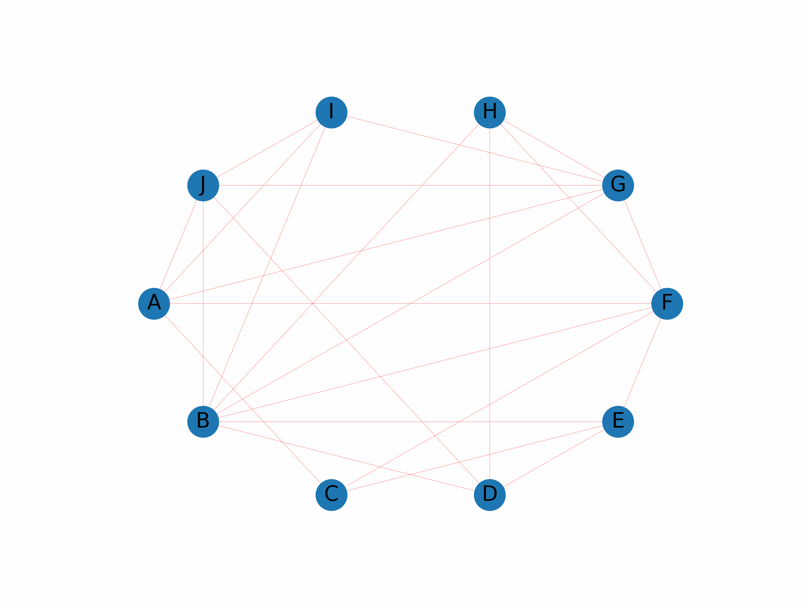

# ECM3428 Algorithms that Changed the World: Borůvka's Algorithm Project

## Grade 69/100

This repository contains the materials for the Borůvka's Algorithm project, a part of the ECM3428 - Algorithms that Changed the World module at the University of Exeter. This project comprises 40% of the overall module assessment and includes a technical report, source code implementation in Python, animated visualisations, and a video demonstration.

## Project Structure

- `Algorithms_that_Changed_the_World_Report.pdf`: A technical report detailing Borůvka's algorithm's principles, pseudo code, complexity analysis, and applications.
- `Algorithms_that_Changed_the_World_Presentation.pdf`: Slides presentation complementing the report.
- `Boruvkas Algorithm.ipynb`: Python source code implementing Borůvka's algorithm, with comments and visualisations.
- `animation`: Directory containing GIFs and PNGs showing the algorithm's execution steps.
- `graph_pkl`: Pickle files storing graph data structures.
- `link.txt`: External links to video demonstrations.
- `mst graphs`: Directory of Minimum Spanning Tree (MST) visualisations in different scenarios.
- `processed_graphs`: Processed graph data for real-world networks.
- `real network data`: Original data of real-world networks with graphs and edge information.
- `Video.mkv`: Video demonstration of Borůvka's algorithm and its applications.

## Report Abstract

The report delves into Borůvka's algorithm, a crucial technique in graph theory for finding MSTs. It covers the algorithm's execution steps, pseudo code, complexity, and applications in various domains like network design and cluster analysis. The report also discusses algorithmic limitations and potential improvements.

## Implementation

The Python code includes necessary libraries, defines nodes and edges, and implements Borůvka's algorithm with options for animation and visualisations. It demonstrates the algorithm on sample and real-world graphs, visualising both the original graphs and their corresponding MSTs.

## Video Demonstration

The video explains Borůvka's algorithm, its significance, and showcases the Python code's implementation and execution.

## Animation Example

Below is an animated visualisation of Borůvka's algorithm in action:

## Usage Instructions

1. Read the `Algorithms_that_Changed_the_World_Report.pdf` for theoretical knowledge of the algorithm.
2. Explore `Boruvkas Algorithm.ipynb` for practical implementation and visualisation.
3. Watch `Video.mkv` for a comprehensive understanding and demonstration.
4. Examine the `animation` and `mst graphs` directories for visual insights.
